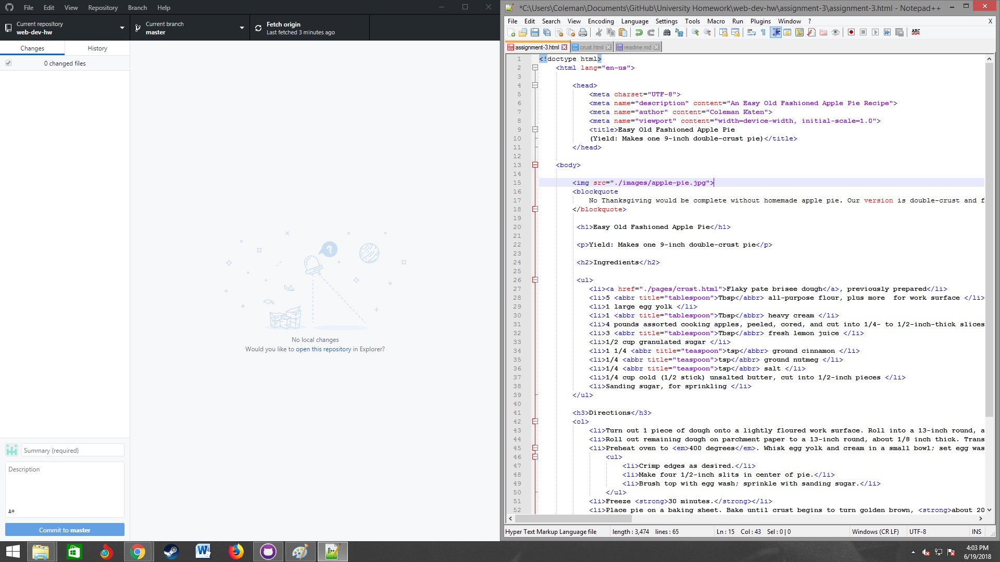

## Assignment 3

In any web page there can only be one Head and Body element, and for example inside the head elemets is where we find things about how the website is set up, and inside the body element is where we find everything that is viewable to the visitor.
The difference between structural markup and semantic markup is that structural is the big idea like this goes here and this goes there, the semantic mark up then goes in and is sort of the guy who dots the i and crosses the t, he interprets the stuctural markup and makes it look neat.
I spent this week catching up I kind of ran through the materials and started the project and went through googling alot of things I did look at the website which was very helpfull I read through the material provided on the website but this week was ver fluid and I felt as if I was really getting my feet under me during this week.  I also did switch from atom to Notepad and have had alot more ease with what I have been doing I find both helpfull but notepad more userfriendly and cut and dry not so mant places to get lost.

