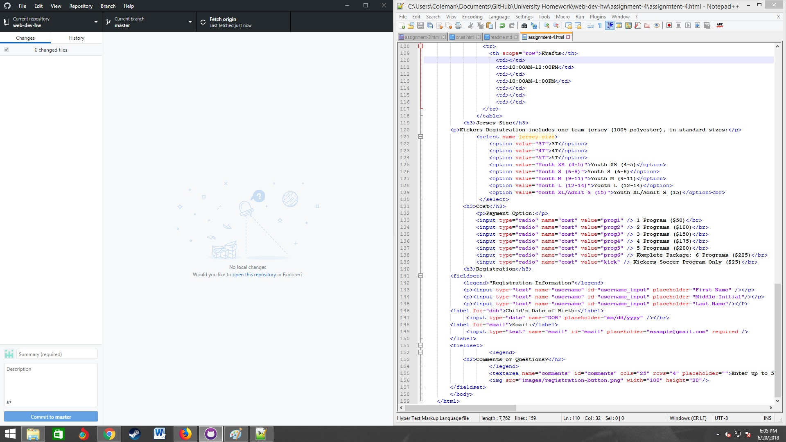

## Assignment 4
What is alt text?
The alt text is an alternative way for people who may have a seeing disorder to still have the oppertunity to know what a picture is talking about or what its supposed to be about without actually seeing it.
What forms of alt text have I ran into and what purpose do they serve?
I feel like I have become very numb to alt text boxes just because of how often that I see them on the internet. I grew up in a very protective home my mom nearly prided herself on how secure all her websites and emails and passwords were but being in college I tend to get irritated when those alt text boxes dont remember my infor but I do see them fairly often yet while signing up for new subscriptions and what not.
Work I did for this assignment.
For this assignment I considered it the most challenging so far but I did give it 100%. I started out by reading the material then I copy and pasted assignment3 into a new folder changed the name so that my foundation was still there and from there I took it step by step looking things up as I had questions and became very pleased with how the assignment turned out.

